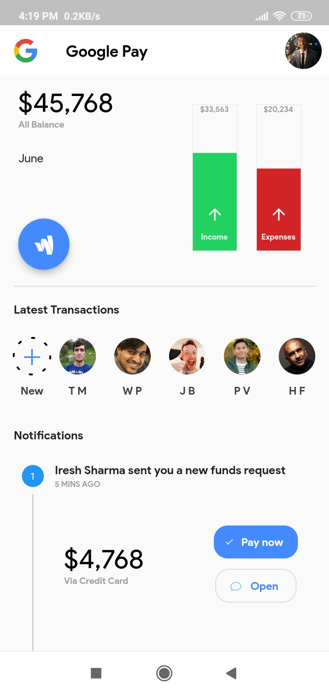
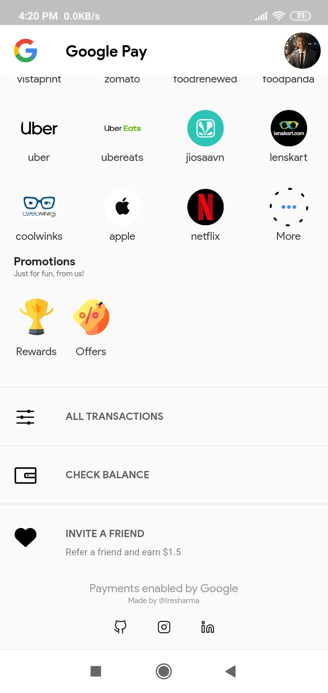
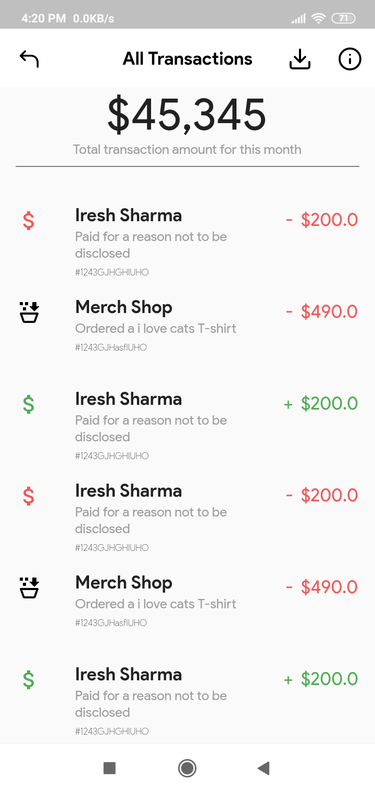
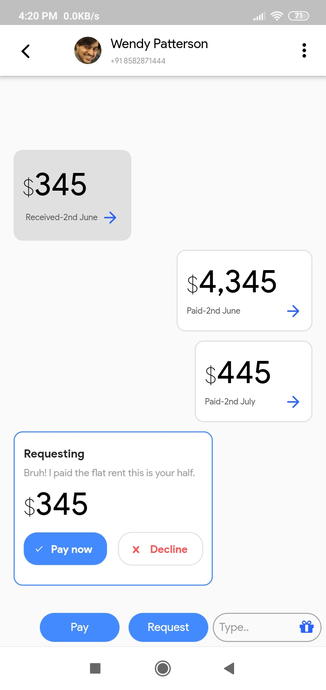
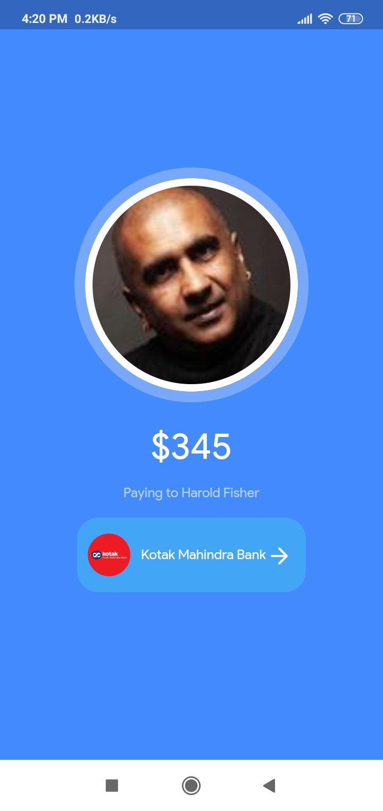

# google_pay_redesign

Recently Google launched Google entirely built with Flutter in India and Singapore. So i thought to re think the UI and make something similar as an attempt to practice Flutter UI.
this design is inspired by [this dribble design](https://dribbble.com/shots/5312568-Google-Pay-Redesign-UX-Concept?utm_source=Clipboard_Shot&utm_campaign=DhipuMathew&utm_content=Google%20Pay%20-%20Redesign%20UX%20Concept&utm_medium=Social_Share)

## ScreenShots

### Main

### Home 
| 1 | 2 | 3 |
|---|---|---|
|  |  |  |

| Transaction | ChatWindow | Payment Screen | Invite Screen |
|-------------|------------|----------------|---------------|
|  |  |  |  |
